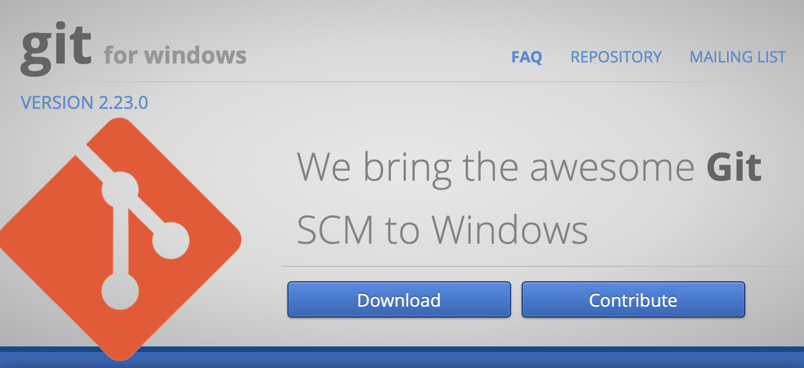
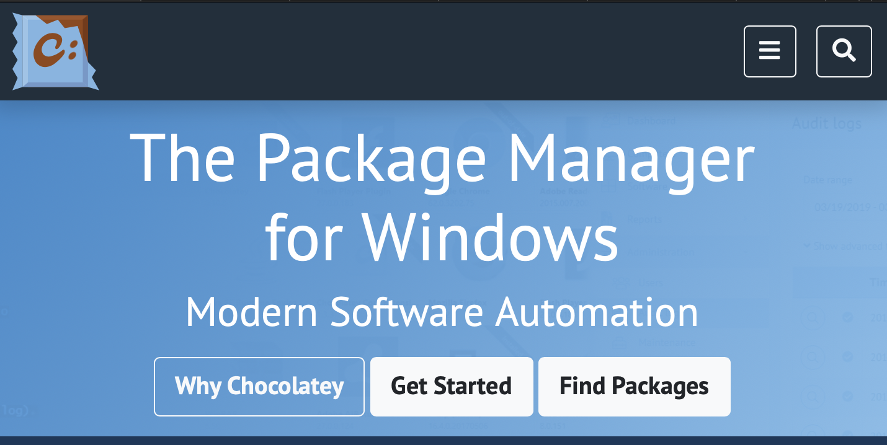
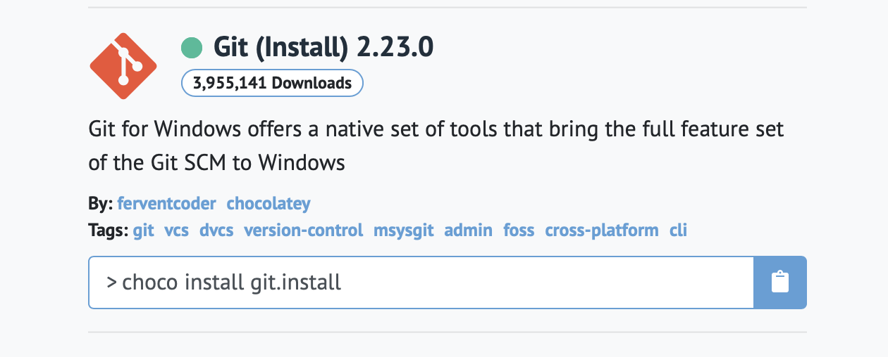
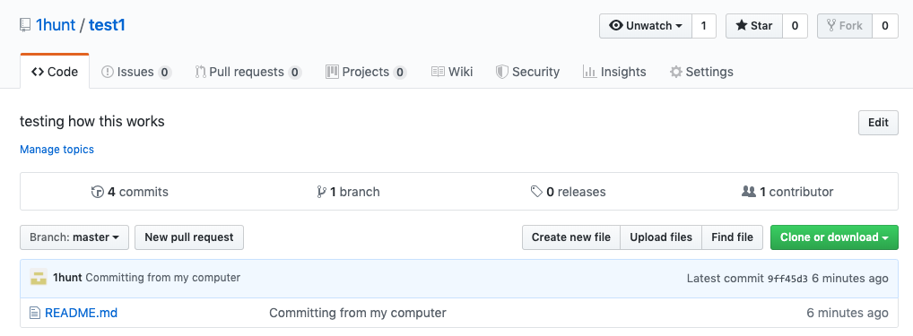

```{r setup, include=FALSE}
knitr::opts_chunk$set(echo = TRUE)
```
# Part One: Introduction and Installation 

In order for our science to be reproducible, four main concerns need to be addressed.

1. Storage: One needs to store data and code in a safe and secure way. Storing data on a cloud server protects data from computer failures, viruses, lost flash drives, spilled beverages, etc.
2. Access: One can access data from different devices in different places.
3. Collaboration: Collaborators can access  and update data and code.
4. Version Control: Git and GitHub offer collaborators the opportunity to make changes to data or code while tracking different versions of the changes. 

### Useful References:
* https://happygitwithr.com
* https://rogerdudler.github.io/git-guide/
* https://englianhu.files.wordpress.com/2016/01/reproducible-research-with-r-and-studio-2nd-edition.pdf Chapter 5.
* http://swcarpentry.github.io/git-novice/

## 1. Introduction: Why Git and GitHub?
### What's the difference between Git and GitHub?

Git is a **version control system** that is like a supped up version of the "Track Changes" feature within Microsoft Word.  

GitHub is a cloud based platform built around Git that stores code *__pushed__* to it from a computer that uses Git.

In this turtorial you will register for a GitHub account, install Git, connect RStudio to Git and learn how to track versions through branches, pulls, commits, pushes, fetches, and merges.

## 2. Register for a GitHub Account

If you do not currently have a GitHub account then you will register for one today! 

1. Go to https://github.com
2. Pick a username that incorporates your actual name. Enter an email and create a password.
3. Select a plan: Free is all you will likely need.
4. (optional) Answer a few questions about your code skill level, plans for using GitHub, and lost some interests.
5. You'll get a verification email. 
6. When you click the link from the Verification you will be taken to your new GitHub account with the option to create your first repository or *repo*. Do not make one yet. We will come back to that. 

## 3. Upgrade R and RStudio
We all have R and RStudio on our own computers by now, but here you can check your version and upgrade if needed.

```{r version, echo=TRUE }
R.version.string
```

If you would like to update your current R packages you can use the following command:

```{r update, eval=FALSE, echo=FALSE}
update.packages(ask = FALSE, checkBuilt = TRUE)
```

## 4. Install Git
Open up the terminal or shell and check to see if you already git installed.

```{}
which git
git --version
```

### 4.1 Windows Installation
There are two options for Windows installation:
**Option 1:**  Install Git for Windows (https://gitforwindows.org), aka _msysgit_ or "Git Bash", which will provide Git as well as a Bash shell.

_side note on shells/terminal/bash. Windows OS doesn't provide a shell terminal. Shell refers to an early (1970s) command-line interpreter for Unix shell.  Bash (**B**ourne **a**gain **sh**ell) is the command-line interpreter for GNU (**g**nu **n**ot **u**nix) OS. It's all still very confusing, just know that bash is largely compatible with shell, and that for many Git commands the "Git Bash" shell/terminal will need to be used._

```{r installwind, echo=FALSE, out.width = '50%'}

```

Pick the executable file that is best for your system. When asked about "Adjusting your PATH environment" select "Git from the command line and also from 3rd-part softwar." Accept other defaults.

RStudio for Windows prefers for Git to be installed in the C:/Program Files and will be the default. The Git executable will be located at C:/Program Files/Git/bin/git.exe. Use this convention unless you _really_ do not want to.

**Option 2:** Install Git from the Chocolatey package manager (https://chocolatey.org). You'll need to have Chocolatey installed (https://chocolatey.org/install) which may be useful if you plan on installing other open source software down the road.

```{r choco, echo=FALSE, out.width = '50%'}

```

```{r chocoGit, echo=FALSE, out.width = '50%'}

```

After Chocolately is installed, in a shell type:

```{bash chocoinstall, eval=FALSE, echo=TRUE}
choco install git.install
```

The most current version is Git 2.23.0.

### 4.2 macOS Installation
There are also several options for installing Git on a macOS.
**Option 1:** In the shell/terminal with Xcode:

```{bash macinstall, eval=FALSE, echo=TRUE}
git --version
git config
```

This will prompt an offer to install. Accept the offer.

Or more directly:
```{bash macinstallxc, eval=FALSE, echo=TRUE}
xcode-select --install
```

**Option 2:** Download git from here http://git-scm.com/downloads

**Option 3:** Download using Homebrew
```{bash homebrew, eval=FALSE, echo=TRUE}
brew install git
```

## 5. Bonjour Git, enchante: git config

Now that Git is installed on your computer, let's get to know Git. First, set up your global environment. Make sure to use the same user name and emial you used to set up your GitHub account. Use your preferred text editor (other options include "emacs".)

```{bash git_global, eval=FALSE, echo=TRUE}
git config --global user.name 'Katie Murenbeeld'
git config --global user.email 'katiemurenbeeld@u.boisestate.edu'
git config --global core.editor "vim"
git config --global --list
```

There is a package within R that can also set your Git user name and email.

```{r usethis, eval=FALSE, echo=TRUE}
## install if needed (do this once):
# install.packages("usethis")

library(usethis)
use_git_config(user.name = "Kaite Murenbeeld", user.email = "katiemurenbeeld@u.boisestate.edu")

```

## 6. Connect to GitHub 


### 6.1  Make a repo

Here, we are just making sure we can push and pull and everyone is communicating.

1. Head to https://github.com/ and check that you're still logged in

2. Click on the green "New" button or click on "Repositories" on your profile page and then click on the "New" button. 
```{r pressure, echo=FALSE, out.width = '100%'}

```

3. Fill in:

Repository name 

Description: something for the README file

Public (for now)

and then YES initilize the repo with a README

For everything else, select default.

4. Click "Create repository"

5. Copy the HTTP clone URL to your clipboard via green "Clone or Download" button

### 6.2 Clone your repo to a local computer

1. Head to terminal or shell
  
    a. Determine what directory you’re in by printing your working directory:
    
          $ pwd
    
    b. Change the directory (cd) you’re in to a temporary folder:
    
         $ cd ~/tmp
    
2. Add the HTTP clone URL from your clipboard:
    
         $ git clone [paste link here]
    
3. Change directory to your new repo:

        $ cd [repo name here]
    
        List the files in the repo:
    
        $ ls
        
        Look at what's in the README.md file:
    
        $ head README.md
        
        Look at where this info is sourced from:
    
        $ git remote show origin

### 6.3  Make a change, commit and push
1. Add a link to the README.md to see if Git recognizes something is changing:

        $ echo "note to self" >> README.md
    
        $ git status
  
This will tell you what git sees in the working directory and the master branch. Git should tell you that something was modified - the README.md file - nothing else has happened. The local version of the branch you're on (master) is up to date with the GitHub version master. That's because you haven't officially staged your changes you made to the README.md file to be added, nor have you committed those changes to the master.

2. Stage the change, commit and finally push to the remote repository on GitHub. You may be prompted to log-in at this point.
        
        $ git add -A
git add -A, --all, means add changes from all tracked and untracked files

        $ git commit -m [commit message here that explains what you are doing]
-m, providing a commit message for every commit is important for everyone to understand each step in the progression of the project
        
        S git push
  
### 6.4 Confirm all the local changes make it to the remote GitHub repository

1. Go online to your account and look at the history of your new repo. Did the changes you just made appear?
```{r local-Github, echo=FALSE, out.width = '75%'}

```
  
### 6.5 Clean up your test repo

1. Delete locally:

    $ rm -rf [your test repo name]
 -rf, means force remove a directory and contents without confirmation

2. Delete remotely GitHub account:

    a. Go to Settings under repo homepage
    b. Scroll ALL the way down to the bottom of the page - to the Danger Zone
    c. Delete repository to erase all existance.
  
## 7. Detect Git from RStudio

1. Create repository from RSTudio/GitHub, see if it appears on GitHub/RStudio

2. Set global directory path to Git in RStudio
		a. >Tools >Global Options >Git/SVN
		b. Git executable:
			  i. Windows::C:/Program Files/Git/bin/git.exe
			  ii. Mac::/usr/bin/git
        
## 8. RStudio, Git, GitHub Hell
 
1. Various debugging tips
 
## 9. New Project, GitHub first
 
1. Click green "create repository" button on GitHub home page
  a. Repository name
  b. public or private
  c. YES, create README
 
2. Connect to the new repo in RStudio
  a. File > New Project > Version Control > Git
  
  b. Repository URL: https://github.com/username/reponame
  
3. Stage, Commit, Push documents to GitHub
  a. Create/Load documents
  b. Stage documents by clicking check box next to their name in Git window in upper right of RStudio
  c. Commit by pressing "Commit" button in Git window
      i. opens new window
      ii. add commit message and click commit button
  d. Click green up arrow in Git window to push documents to GitHub
    
4. Pull a repository from GitHub by pressing the blue down arrow in the Git window
  i. access repository files in Files window in lower right of RStudio
  
## 10. Branching
1. Branches are separate lines of edits which enable multiple people to work at the same time without destroying each others work
2. The main branch is named ‘Master’ by default
3. To create new branch:
	a. Git Shell::$ git branch branch_name 
	b. RStudio:: Button in Git window
4. To switch between branches
	a. Git Shell::$ git checkout branch_name
    	b. RStudio:: Button in Git window
5. To merge branches
    	a. Do this in Git Shell, not RStudio or GitHub:
        	$ git checkout master #switch to master branch
        	$ git merge branch_name #merge branch_name into master
    	b. Conflicts
        	i. if merging branch conflicts with main, CONFLICT message will show in Git Shell
        	ii. find out more about the conflict: Git Shell::$ git status
        	iii. resolve conflict: open file from the main branch in R, edit to meet desired outcome
6. Abandon merge: Git Shell::$ git merge --abort
 


